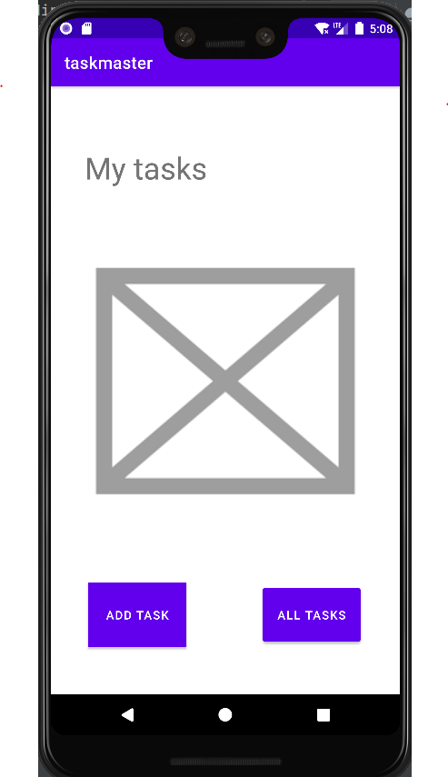
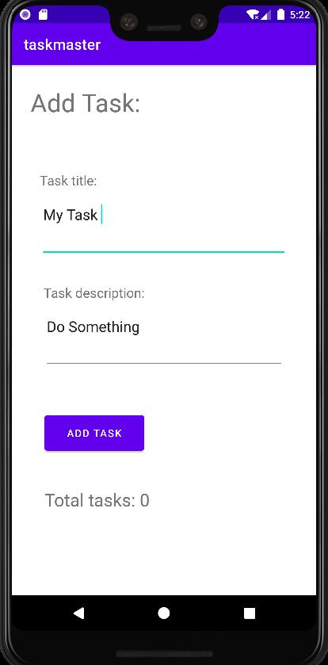
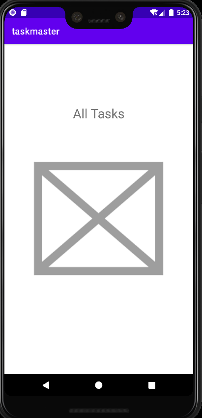
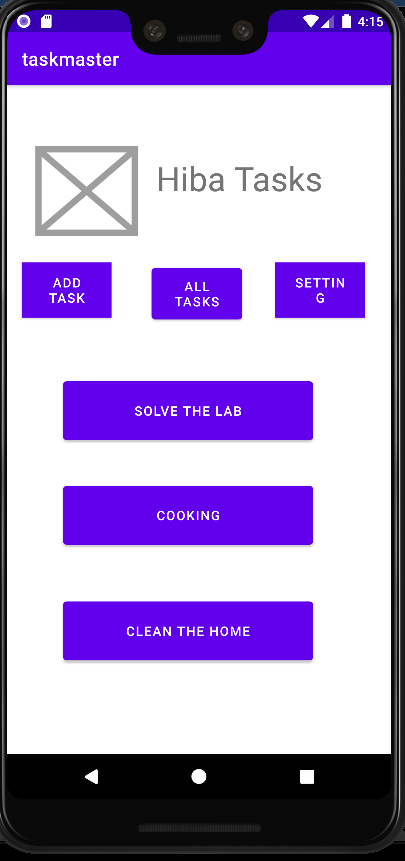
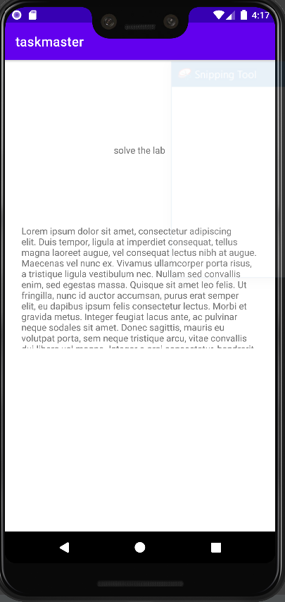
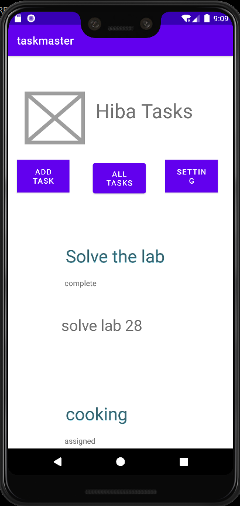
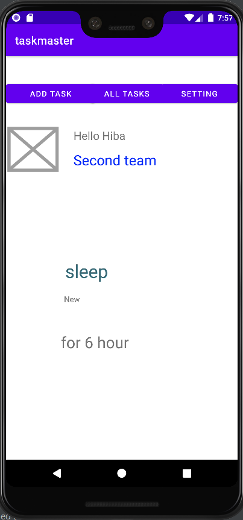
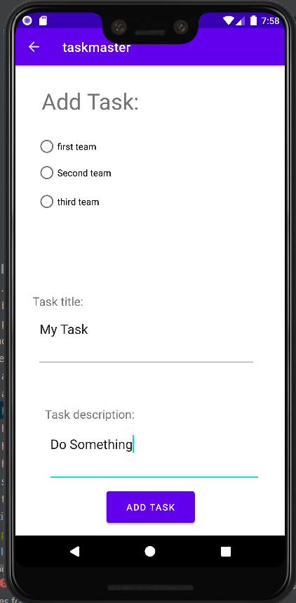
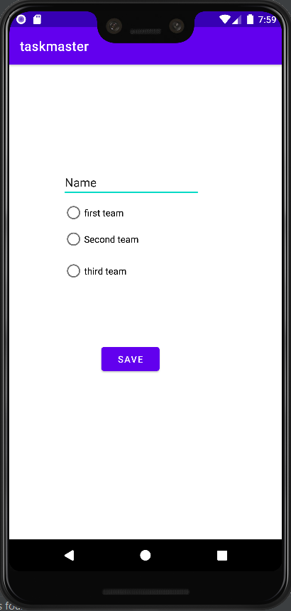

# taskmaster

**This App will contains tasks to do..** 

`>>` There ara three main activities:

* MainActivity
* AddTaskActivity
* AllTasksActivity

---

#### lab 26 :
* created the three activities.
* connect them with the buttons in the MainActivity
* No functionalities yet

##### Screenshots:

**Home page**

**Add task page**

**All tasks page**

----

#### lab 27 :

* add new three button to the home page for three static tasks.
* create task details page which contain the title of the task and description.
* create setting page which allow the user to inter his name and view it in the home page

##### Screenshots:

**Home page**

**Task details**

**Setting**

------

#### lab 28:

update the home page to be contains RecyclerView which hold the list of tasks and view it as a list for the user with  onClick listener on each ViewHolder to move to task details page with the title of the clicked task

#### Screenshots:

**Home page**

---

#### lab 29:(Room)

* Modify Add Task form to save the data entered in as a Task in local database.

* Refactor homepage’s RecyclerView to display all Task entities in the database.
* Refactor task details page to display the task info.

##### Screenshots:

no update in the UI design  

---

#### lab 32:

* configure and add the Amplify dynamoDB to the app
* create GraphQL model as a schema and the Amplify generated it as model class.
* save and retrieve the data from the dynamoDB instead of RoomDB

##### Screenshots:

no update in the UI design

---

#### lab 33:

* Add new Modal **Team**
* Edit add task page to choose team
* Select the team from Setting page and render the task in the main page depending on what you choose

##### Screenshots:

**Home page**

**Add Task page**

**Setting page**

