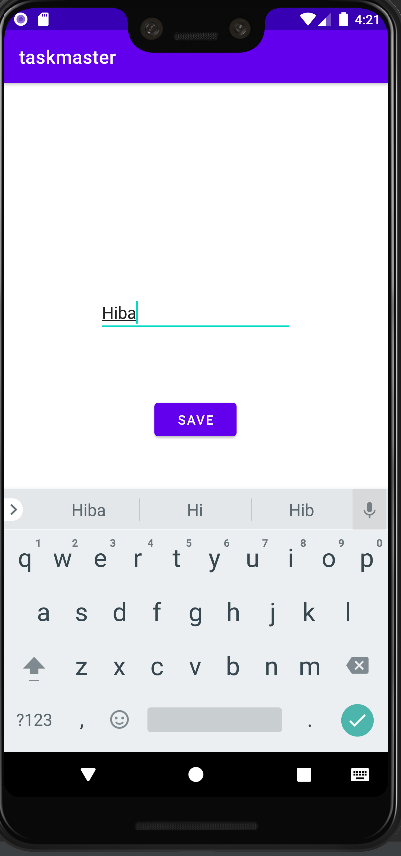

# taskmaster

**This App will contains tasks to do..** 

`>>` There ara three main activities:

* MainActivity
* AddTaskActivity
* AllTasksActivity

---

#### lab 26 :
* created the three activities.
* connect them with the buttons in the MainActivity
* No functionalities yet

##### Screenshots:

**Home page**

**Add task page**

**All tasks page**

----

#### lab 27 :

* add new three button to the home page for three static tasks.
* create task details page which contain the title of the task and description.
* create setting page which allow the user to inter his name and view it in the home page

##### Screenshots:

**Home page**

**Task details**

**Setting**

